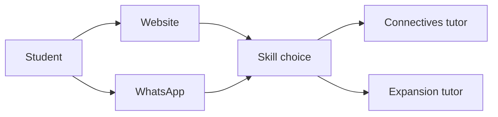
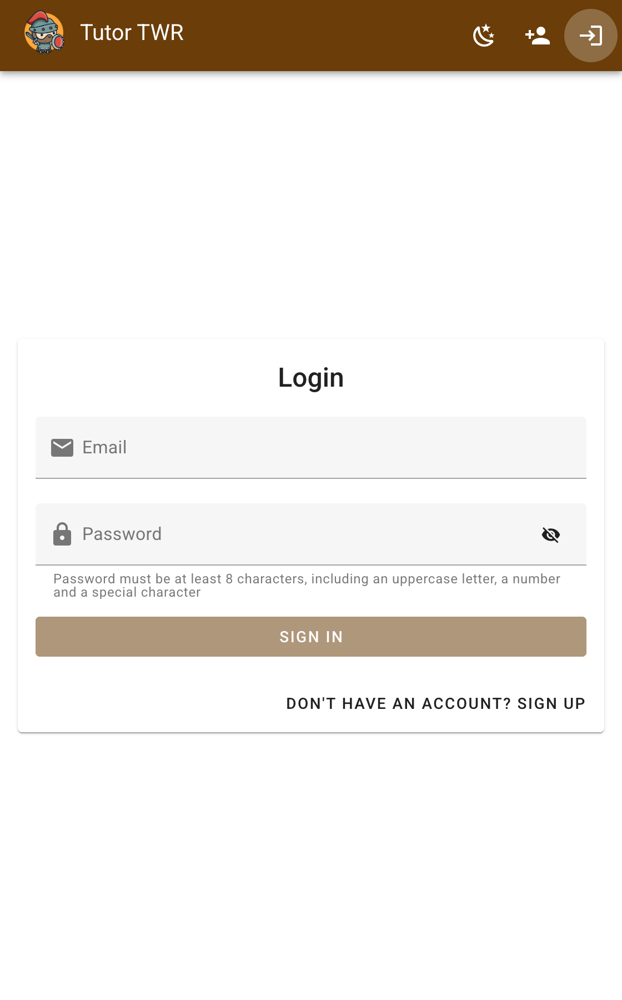
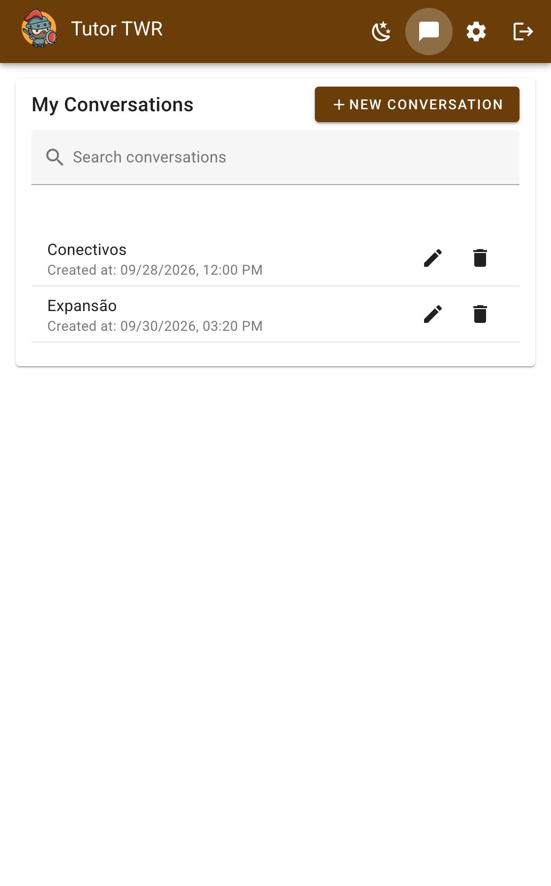
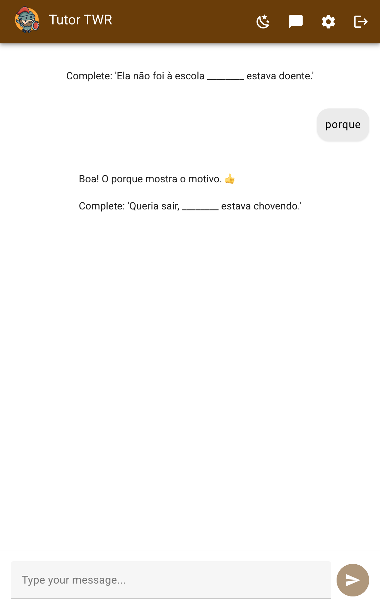

# TWR

TWR supports writing practice for the 7th grade. It follows The Writing Revolution. Two specialists practice textual connectives and sentence expansion. The student stays the author. The tutor does not write the sentence.

## Purpose

TWR is a tutor for writing in Portuguese, based on The Writing Revolution. The student learns by writing, rather than by reading rules alone.

In the conversation, the student chooses one skill. Connectives use *porque*, *mas*, *então*, *embora*, *além disso*, *quando*, and *enquanto*. They express cause, contrast, addition, and conclusion. Expansion turns a short sentence into a fuller one by answering *quem*, *como*, *quando*, *onde*, and *por quê*.

The tutor builds the exercises and the moments of reflection. Those moments follow Zimmerman's theory of self-regulated learning: the student plans, carries out, and evaluates their own writing.

At each step, the tutor explains the next gap and waits for the student's answer. It does not hand over a finished sentence. It does not grade. It does not rewrite the whole text. It does not ask for the student's name, age, or school. The student builds and revises the text. The work follows BNCC skill EF67LP25, practiced from the student's own writing.

Students talk to TWR on the website or on WhatsApp. Each conversation stays with the skill chosen at the start. On the website, the student chooses Connectives or Expansion when the conversation starts. On WhatsApp, the student sends `\connectives` or `\expansion`. Until then, TWR asks which exercise they want. A new WhatsApp session starts after 30 minutes without a message. The same command switches the specialist and asks for the next exercise.



The website is a Vue 3 app with Vuetify. Sign in uses [Orion Users](https://github.com/orion-services/users), with email and password, Google, and two factor authentication. The server is Quarkus.

<p align="center">
  
  
  
</p>

## Documents

The tutors follow the prompts in [connectives.md](src/main/resources/prompts/connectives.md) and [expansion.md](src/main/resources/prompts/expansion.md).

TWR can also read plain text and PDF files from the folder in `rag.location`, and URLs listed in `rag.scrape.urls`. URLs are converted to Markdown. On startup, those documents are indexed and stored as chunks. Each reply may use up to three chunks that pass the similarity threshold. Both settings live in [application.properties](src/main/resources/application.properties). The folder starts empty, and no URLs are configured, so a local conversation is guided by the prompts alone.

## Running locally

You need Java 25, Docker, and [Ollama](https://ollama.com/) with the `gemma3:latest` model. Docker starts Orion Users. Quarkus Dev Services starts the Postgres and Redis databases the application uses in development.

1. Clone this repository.
2. Copy `.env.example` to `.env`. Set `POSTGRES_PASSWORD` and the Gmail SMTP values Orion Users uses for confirmation mail. For local email confirmation, set `ORION_USERS_EMAIL_VALIDATION_URL` to `http://localhost:8082/users/validateEmail`.
3. Copy `frontend/.env.example` to `frontend/.env`. The example already points Orion Users at `http://localhost:8082`. Without that file, login calls TWR's own port and fails.
4. Start Orion Users.

```shell
docker compose up -d postgres redis orion-users
```

5. Start the application.

```shell
./mvnw quarkus:dev
```

Open <http://localhost:8080>. Quarkus builds the Vue app on startup and serves it. You do not need a separate `npm run dev` for normal use.

Development chat uses local Ollama (`gemma3:latest`). Production chat uses OpenAI `gpt-4o-mini`. Embeddings stay on the local `all-MiniLM-L6-v2` model, at 384 dimensions, in every profile. `OPENAI_API_KEY` is required in production, and in development only when you want WhatsApp audio transcribed with Whisper.

The Vue build runs once, when `./mvnw quarkus:dev` starts. If you edit anything under `frontend/src` while development mode is already running, stop it and start it again. Live reload watches `src/main/java` and `src/main/resources` only.

If you want instant reload while you work on Vue components, run this in `frontend`:

```shell
npm run dev
```

Vite then serves the interface at <http://localhost:5173> and proxies API calls to port 8080. That server is only a convenience for frontend work.

The test profile does not start Orion Users. Tests keep the local Ollama model for chat.

In development mode, the Quarkus Dev UI is at <http://localhost:8080/q/dev/>.

WhatsApp is optional. Leave `WHATSAPP_ACCESS_TOKEN` and `WHATSAPP_PHONE_NUMBER_ID` empty and only the website answers.

### Package a jar

```shell
./mvnw package
```

Run the result with `java -jar target/quarkus-app/quarkus-run.jar`. Dependencies are copied into `target/quarkus-app/lib/`. This is not an uber jar.

### Native executable

With GraalVM installed:

```shell
./mvnw package -Dnative
```

Without GraalVM, build inside a container:

```shell
./mvnw package -Dnative -Dquarkus.native.container-build=true
```

Run it with `./target/twr-1.0.0-runner`.

Production runs on a single EC2 instance in São Paulo (`sa-east-1`). See [docs/aws.md](docs/aws.md).
